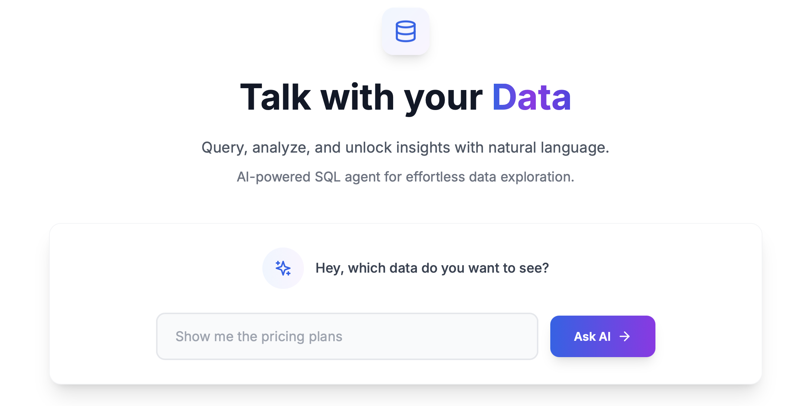
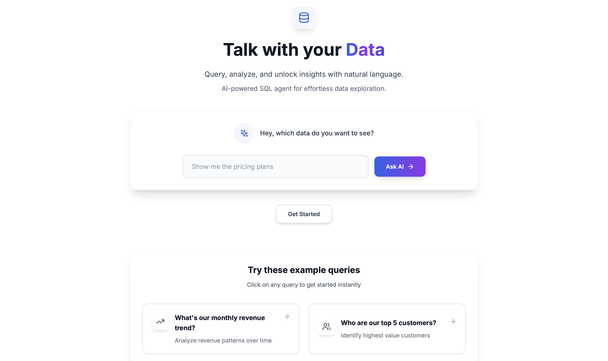
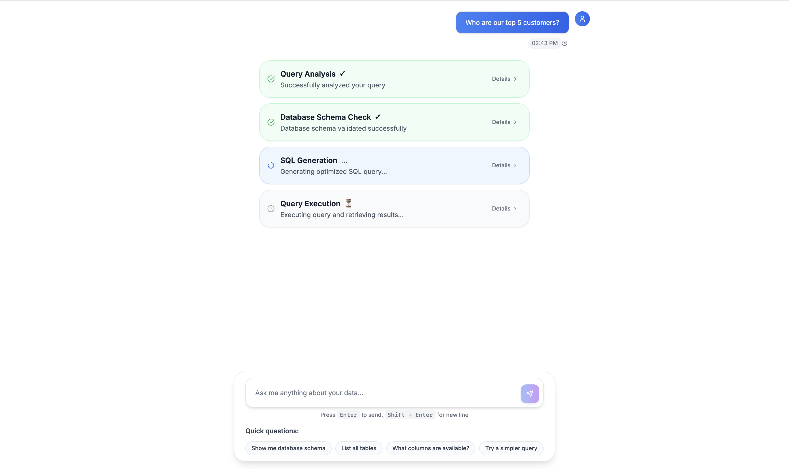
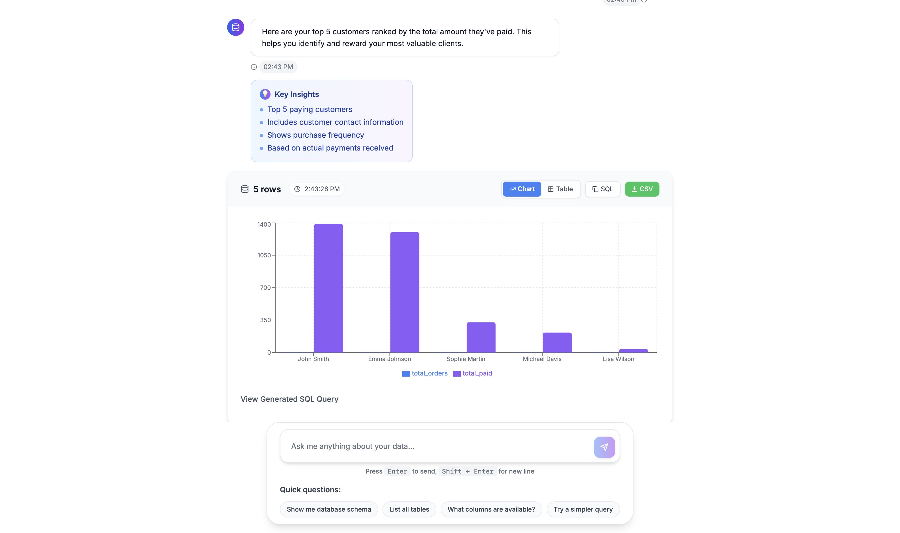

# 🤖 DataChat AI - Natural Language Database Query Interface


[](https://choosealicense.com/licenses/mit/)
[](http://makeapullrequest.com)


A modern, AI-powered interface that allows users to query their database using natural language. Built with Next.js, TypeScript, and powered by Google's Gemini AI.

## 🎬 Demo Video



> **Live Demo**: [dat-ai.netlify.app](https://dat-ai.netlify.app)

*Watch how DataChat AI transforms natural language questions into insightful data visualizations in real-time!*

---

## 🌟 Features

### 💬 **Natural Language Processing**
- Ask questions in plain English
- No SQL knowledge required
- AI-powered query generation using Google Gemini

### 📊 **Smart Data Visualization**
- Automatic chart type detection
- Interactive charts (Line, Bar, Pie)
- Professional data tables
- Export capabilities (CSV, SQL)

### 🎨 **Modern UI/UX**
- Professional chat interface
- Responsive design
- Real-time suggestions
- Clean, minimalist design

### 🔍 **Business Intelligence**
- Revenue analytics
- Customer insights
- Product performance
- Sales trends

## 🚀 Quick Start

### Prerequisites


### Installation

1. **Clone the repository**
   ```bash
   git clone https://github.com/AnshAgg1303/DATAI.git
   cd DATAI
   ```

2. **Install dependencies**
   ```bash
   npm install
   # or
   yarn install
   ```

3. **Environment Setup**
   Create a `.env.local` file:
   ```env
   NEXT_PUBLIC_SUPABASE_URL=your_supabase_url
   NEXT_PUBLIC_SUPABASE_ANON_KEY=your_supabase_anon_key
   GEMINI_API_KEY=your_gemini_api_key
   ```

4. **Database Setup**
   Create the required SQL function in Supabase:
   ```sql
   CREATE OR REPLACE FUNCTION execute_sql(sql_query text)
   RETURNS json
   LANGUAGE plpgsql
   SECURITY DEFINER
   AS $$
   DECLARE
       result json;
   BEGIN
       EXECUTE sql_query INTO result;
       RETURN result;
   EXCEPTION
       WHEN OTHERS THEN
           RETURN json_build_object('error', SQLERRM);
   END;
   $$;
   ```

5. **Run the development server**
   ```bash
   npm run dev
   # or
   yarn dev
   ```

6. **Open your browser**
   Navigate to `http://localhost:3000`

## 📁 Project Structure

```
DATAI/
├── app/
│   ├── api/
│   │   └── smart-query/
│   │       └── route.ts              # API endpoint for query processing
│   ├── favicon.ico                   # App favicon
│   ├── globals.css                   # Global styles & Tailwind imports
│   ├── layout.tsx                    # Root layout component
│   └── page.tsx                      # Home page component
├── components/
│   └── chat/
│       ├── ChatInterface.tsx         # Main chat interface component
│       ├── DataVisualization.tsx     # Charts and data display component
│       ├── InputBox.tsx              # Message input component
│       ├── MessageBubble.tsx         # Chat message bubble component
│       ├── StatusCard.tsx            # Status indicator component
│       └── Suggestions.tsx           # Quick suggestion buttons
├── lib/
│   ├── gemini.ts                     # AI query generation logic
│   └── supabase.ts                   # Supabase client configuration
├── public/                           # Static assets
├── node_modules/                     # Dependencies
├── .env.local                        # Environment variables (create this)
├── .gitignore                        # Git ignore rules
├── eslint.config.mjs                 # ESLint configuration
├── next.config.js                    # Next.js configuration
├── next-env.d.ts                     # Next.js TypeScript declarations
├── package.json                      # Project dependencies and scripts
├── package-lock.json                 # Dependency lock file
├── postcss.config.js                 # PostCSS configuration
├── postcss.config.mjs                # PostCSS configuration (alternative)
├── README.md                         # Project documentation
├── tailwind.config.js                # Tailwind CSS configuration
└── tsconfig.json                     # TypeScript configuration
```

## 🎯 Usage Examples

### Revenue Analysis
```
"What's our monthly revenue trend?"
"Who are our top 5 customers by spending?"
"Show me daily sales for the last 30 days"
```

### Product Performance
```
"Which products sell best?"
"Show me low-stock items"
"What's our product category performance?"
```

### Customer Insights
```
"How many new customers this month?"
"Who are our most loyal customers?"
"Which customers haven't ordered recently?"
```

### Business Analytics
```
"What's our average order value?"
"Show me order completion rates"
"How many orders are pending payment?"
```

## 🔧 Configuration

### Supported Database Tables

The system automatically detects and works with common e-commerce tables:
- `users` - Customer information
- `orders` - Order data
- `products` - Product catalog
- `order_items` - Order line items
- `invoices` - Payment records
- `customers` - Customer details

### Chart Types

- **Line Charts**: Time series, trends, temporal data
- **Bar Charts**: Comparisons, rankings, categories
- **Pie Charts**: Distributions, percentages, breakdowns
- **Tables**: Detailed listings, specific records

## 🎨 Customization

### Styling
The UI uses Tailwind CSS with a professional color scheme:
- Primary: Blue gradient (`from-blue-600 to-purple-600`)
- User messages: Blue (`bg-blue-500`)
- Bot messages: White (`bg-white`)
- Background: Light gray (`bg-gray-50`)

### Adding New Suggestions
Edit `components/chat/Suggestions.tsx`:
```typescript
const suggestionCategories = [
  {
    icon: YourIcon,
    category: "Your Category",
    color: "text-color bg-color",
    suggestions: [
      "Your custom question 1",
      "Your custom question 2"
    ]
  }
]
```

## 📊 Screenshots

### Welcome Page


### Chat Interface


### Data Visualization


## 🛠️ Tech Stack

### Frontend Technologies
 **Next.js 14** - React framework with App Router  
 **TypeScript** - Type-safe JavaScript  
 **React 18** - UI library with modern hooks  
 **Tailwind CSS** - Utility-first CSS framework  
 **Recharts** - Data visualization library  
 **Lucide React** - Beautiful icon library  

### Backend Technologies
 **Supabase** - Backend-as-a-Service platform  
 **PostgreSQL** - Relational database  
 **Google Gemini AI** - Natural language processing  

### Development Tools
 **ESLint** - Code linting and formatting  
 **PostCSS** - CSS post-processing  
 **npm** - Package management  

### Deployment Platforms
 **Netlify** - Recommended deployment platform  
 **Vercel** - Alternative deployment platform  
 **Railway** - Cloud deployment platform  

## 🔒 Security Features

- SQL injection prevention
- Query sanitization
- Read-only database operations
- Environment variable protection

## 🚀 Deployment

### Netlify (Recommended)
[](https://app.netlify.com/start/deploy?repository=https://github.com/AnshAgg1303/DATAI)

1. Push your code to GitHub
2. Connect your repository to Netlify
3. Add environment variables in Netlify dashboard
4. Build command: `npm run build`
5. Publish directory: `.next`
6. Deploy automatically

### Vercel
[](https://vercel.com/new/clone?repository-url=https://github.com/AnshAgg1303/DATAI)

1. Push your code to GitHub
2. Connect your repository to Vercel
3. Add environment variables in Vercel dashboard
4. Deploy automatically

### Other Platforms
- **Railway**: Connect GitHub and deploy
- **Heroku**: Use Node.js buildpack

## 📈 Performance

- **Fast Response Times**: Optimized API calls
- **Caching**: Intelligent query caching
- **Lazy Loading**: Components load on demand
- **Responsive**: Mobile-first design

## 🤝 Contributing

We welcome contributions! Please see our [Contributing Guidelines](CONTRIBUTING.md) for details.

1. Fork the repository
2. Create your feature branch (`git checkout -b feature/AmazingFeature`)
3. Commit your changes (`git commit -m 'Add some AmazingFeature'`)
4. Push to the branch (`git push origin feature/AmazingFeature`)
5. Open a Pull Request

## 📝 License

This project is licensed under the MIT License - see the [LICENSE](LICENSE) file for details.

## 🆘 Support

- **Documentation**: Check this README
- **Issues**: [Create a GitHub issue](https://github.com/AnshAgg1303/DATAI/issues)
- **Discussions**: [Use GitHub Discussions](https://github.com/AnshAgg1303/DATAI/discussions)
- **Email**: support@your-domain.com

## 🎯 Roadmap

- [ ] Multiple database support (MySQL, MongoDB)
- [ ] Advanced chart types (Scatter, Radar, Heatmaps)
- [ ] Export to PDF reports
- [ ] Scheduled automated reports
- [ ] Team collaboration features
- [ ] Custom dashboard builder
- [ ] Real-time data streaming
- [ ] Mobile app companion

## 📊 Analytics

Track your usage with built-in analytics:
- Query frequency and patterns
- Popular questions and insights
- Performance metrics and optimization
- User engagement and satisfaction

## 🙏 Acknowledgments

- [Google Gemini AI](https://ai.google.dev/) for powerful natural language processing
- [Supabase](https://supabase.com/) for seamless backend infrastructure
- [Recharts](https://recharts.org/) for beautiful data visualizations
- [Tailwind CSS](https://tailwindcss.com/) for elegant styling
- [Lucide](https://lucide.dev/) for beautiful icons

---

**Made with ❤️ using Next.js and AI**

[⭐ Star this repo](https://github.com/AnshAgg1303/DATAI) | [📖 Documentation](https://docs.your-domain.com) | [🐛 Report Bug](https://github.com/AnshAgg1303/DATAI/issues) | [💡 Request Feature](https://github.com/AnshAgg1303/DATAI/issues/new?template=feature_request.md)
